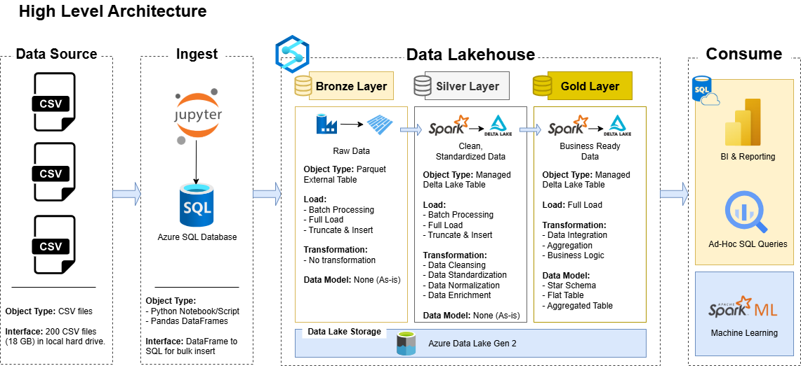

# QR Payment Analytics Project

## Introduction

Welcome to the **QR Payment Analytics Project** repository!

This project represents a comprehensive journey through modern data engineering challenges and solutions, built on the Azure platform. What started as a simple CSV-to-PowerBI integration evolved into a sophisticated data lakehouse architecture that demonstrates real-world problem-solving in data analytics. The project showcases how technical challenges drive learning and innovation, ultimately leading to an enterprise-grade medallion architecture solution for processing over 80 million QR payment transactions.

This portfolio project highlights not just the final solution, but the iterative learning process and decision-making that led to adopting industry best practices in data engineering and analytics.

## The Journey: From CSV to Enterprise Data Lakehouse

### 🎯 Initial Challenge
The project began with a straightforward requirement: analyze QR payment transaction data stored in multiple CSV files (200 files, 18GB) on local hard drive and create PowerBI dashboards for business insights.

### 📈 Evolution Through Problems and Solutions

#### Phase 1: Direct Database Approach
**Initial Solution**: 
- Used Python Notebook to bulk upload CSV files to Azure SQL Database
- Planned to connect PowerBI directly to the relational database

**Problem Encountered**: 
- Extremely slow data transformation and cleaning processes, espcially for big transactional data
- Inefficient data normalization within relational database
- Poor performance for complex analytics queries
- Semantic model creation was time-consuming and resource-intensive

#### Phase 2: Spark-Powered Transformation
**Learning & Solution**: 
- Discovered the power of Apache Spark for large-scale data processing
- Implemented data transformation, cleaning, and normalization using Spark via Azure Databricks
- Significantly improved processing speed and efficiency

**New Problem**: 
- Data stored in Data Lake as Parquet/Delta Lake format was not suitable for direct PowerBI querying
- Performance issues with 80+ million transaction rows
- PowerBI struggled with large-scale transactional data directly from Data Lake

#### Phase 3: Enterprise Lakehouse Architecture
**Final Learning & Solution**: 
- Discovered Azure Synapse Analytics capabilities
- Learned to combine Spark Pools and SQL Serverless Pools
- Implemented medallion architecture (Bronze-Silver-Gold) on Data Lake Storage Gen 2
- Achieved direct PowerBI querying through SQL Serverless Pool with excellent performance

## High-Level Architecture

## Current Solution: Medallion Data Lakehouse

### 🏗️ Data Flow Architecture

#### Data Source Layer
- **Source**: Multiple CSV files (200 files, 18GB) stored on local hard drive
- **Content**: QR payment transaction data
- **Challenge**: Distributed files requiring bulk processing

#### Ingestion Layer  
- **Tool**: Python Notebook with Pandas DataFrames
- **Process**: Bulk upload from CSV files to Azure SQL Database
- **Purpose**: Initial data landing and validation
- **Interface**: DataFrame to SQL for bulk insert operations

#### Data Lakehouse - Medallion Framework

##### Bronze Layer (Raw Data)
- **Storage**: Azure Data Lake Storage Gen 2
- **Format**: Parquet External Tables
- **Process**: 
   - Azure Data Factory pipelines to extract data from Azure SQL Database
   - Batch Processing with Full Load operations
   - Data Lake & Insert operations for incremental updates
- **Processing Engine**: Azure Data Factory for orchestration, Spark on Azure Databricks for data manipulation
- **Transformation**: No transformation (preserving raw data lineage)
- **Data Model**: As-is structure from source

##### Silver Layer (Cleaned Data)
- **Storage**: Managed Delta Lake Tables on Azure Data Lake Storage Gen 2
- **Format**: Delta Lake files with ACID properties
- **Process**:
   - Batch Processing using Spark Pool in Azure Synapse Analytics
   - Full Load with Truncate & Insert pattern for data refresh
- **Processing Engine**: Spark Pool within Azure Synapse Analytics platform
- **Transformation**:
   - Data Cleansing and validation using PySpark
   - Data Standardization across payment channels
   - Data Normalization for consistent schema
   - Data Enrichment with business rules and derived columns
- **Data Model**: Standardized schema (As-is with improvements)

##### Gold Layer (Business-Ready Data)
- **Storage**: Managed Delta Lake Tables on Azure Data Lake Gen 2
- **Process**:
   - Full Load with advanced business transformations
   - Spark-based aggregation and business logic implementation
- **Transformation**:
   - Data Integration across business domains
   - Aggregation for pre-calculated KPIs
   - Business Logic for analytics-ready metrics
- **Data Model**:
   - Star Schema with Fact and Dimension tables
   - Aggregated Tables for optimal query performance

#### Consumption Layer

##### Business Intelligence & Reporting
- **Platform**: PowerBI connected via Azure Synapse SQL Serverless Pool
- **Capability**: Ad-Hoc SQL Queries directly on Delta Lake data
- **Performance**: Optimized for 80+ million transaction analysis
- **User Experience**: Fast, responsive dashboards and reports

##### Machine Learning & Advanced Analytics
- **Platform**: Spark ML integrated with the data lakehouse
- **Capabilities**: Customer churn prediction, fraud detection, transaction optimization

**Technology Stack**

* **Cloud Platform**: Microsoft Azure
* **Data Orchestration**: Azure Data Factory
* **Data Processing**: Apache Spark on Azure Databricks (Bronze Layer), Spark Pool in Azure Synapse Analytics (Silver & Gold Layers)
* **Data Lakehouse**: Azure Synapse Analytics (SQL Serverless Pool and Spark Pool) on top of Azure Data Lake Storage Gen 2
* **Initial Storage**: Azure SQL Database
* **Development**: Python Notebooks, Jupyter
* **Business Intelligence**: Microsoft PowerBI
* **Data Formats**: Parquet, Delta Lake, CSV
* **Programming Languages**: Python, PySpark, Spark SQL, SQL

## PowerBI Dashboard & Analytics

### Interactive Business Intelligence Dashboard

This project features a comprehensive PowerBI dashboard that provides real-time insights into QR payment analytics. The dashboard delivers actionable business intelligence through interactive visualizations and KPI monitoring.

#### Dashboard Features

**Executive Summary View:**
**Merchant Performance Metrics & KPIs:**
**User Performance Metrics**

#### Dashboard Access

**Live Dashboard:** [VNPAY QR Payment Analytics Dashboard](https://app.powerbi.com/links/-7ylGa7nbi?ctid=f4fe40e9-2aca-4f19-a900-802821146fed&pbi_source=linkShare&bookmarkGuid=59316a18-0cf1-4afa-a728-212ba3472d63)

📊 **Demo Access Available:** Contact me for demo account credentials to explore the full interactive dashboard with real-time data

**Sample Dashboard Preview:** Refer to the PDF documentation included in this repository for detailed dashboard screenshots and feature overview

#### Technical Integration

The PowerBI dashboard connects directly to Azure Synapse SQL Serverless Pool, enabling:
- **Real-time Data Access:** Direct querying of 87M+ transaction records
- **Optimized Performance:** Year/month partitioned Delta Lake tables
- **Scalable Architecture:** Auto-scaling based on query demand
- **Security:** Row-level security and data governance compliance

#### Business Impact

The dashboard enables stakeholders to:
- Monitor daily payment processing performance
- Track merchant and user engagement metrics
- Identify high-value customers and transaction patterns
- Make data-driven decisions for business growth
- Detect anomalies and potential fraud in real-time

---

## Key Learning Outcomes

### 🎓 Technical Skills Developed

#### Problem-Solving Approach
- **Iterative Development**: Learning to evolve solutions based on real-world challenges
- **Performance Optimization**: Understanding when and why to choose different technologies
- **Architecture Decision-Making**: Balancing simplicity vs. scalability requirements

#### Technology Mastery
- **Azure Ecosystem**: Deep hands-on experience with multiple Azure services
- **Spark Processing**: Large-scale data processing and optimization techniques
- **Delta Lake**: ACID transactions and schema evolution in data lakes
- **Synapse Analytics**: Combining Spark Pools and SQL Serverless Pools effectively

#### Data Engineering Best Practices
- **Medallion Architecture**: Industry-standard Bronze-Silver-Gold pattern implementation
- **Data Quality**: Implementing validation and cleansing at appropriate layers
- **Performance Tuning**: Optimizing queries for 80+ million row datasets
- **Tool Integration**: Seamlessly connecting multiple Azure services

### 📊 Business Impact Achieved

#### Performance Improvements
- **Query Performance**: Improvement in PowerBI dashboard load times
- **Processing Speed**: Reduction in ETL processing time using Spark
- **Scalability**: Architecture now handles 80+ million transactions efficiently
- **User Experience**: Real-time responsive analytics for business users

#### Technical Achievements
- **Data Volume**: Successfully processing 18GB across 200 CSV files
- **Architecture Scalability**: Solution scales horizontally with data growth
- **Tool Mastery**: Integrated 6+ Azure services into cohesive solution
- **Best Practices**: Implemented enterprise-grade data engineering patterns

## Lessons Learned

### 🔍 Key Insights

1. **Start Simple, Evolve Smart**: Initial simple solutions help understand requirements before building complex architectures
2. **Performance Drives Architecture**: Real performance issues lead to better technology choices
3. **Tool Selection Matters**: Choosing the right tool for each job significantly impacts success
4. **Integration is Key**: Modern data solutions require seamless integration between multiple tools
5. **Business Requirements Drive Technology**: Technical decisions should always serve business needs

### 🚀 Future Enhancements

- **Real-time Streaming**: Azure Event Hubs integration for live transaction processing
- **Advanced Analytics**: Machine learning models for fraud detection and customer insights

## Contact & Collaboration

This project represents a journey of continuous learning and problem-solving in modern data engineering. It demonstrates how challenges drive innovation and lead to enterprise-grade solutions. The iterative approach showcases real-world development practices and decision-making processes.

For questions about the implementation, technical discussions, or collaboration opportunities, please feel free to reach out!

---
